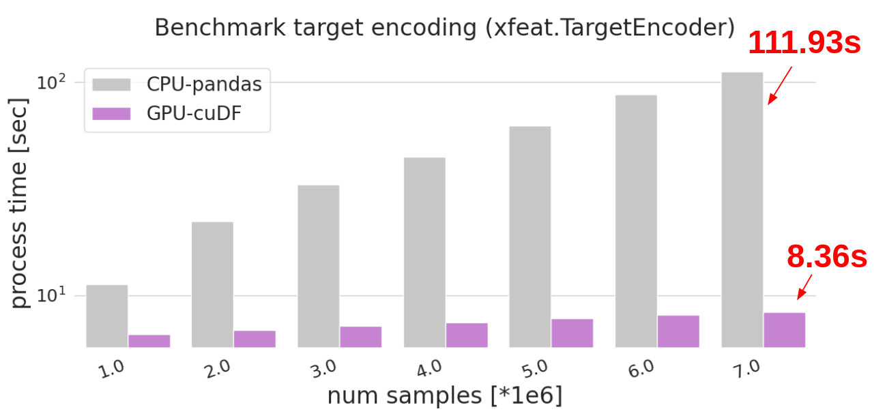
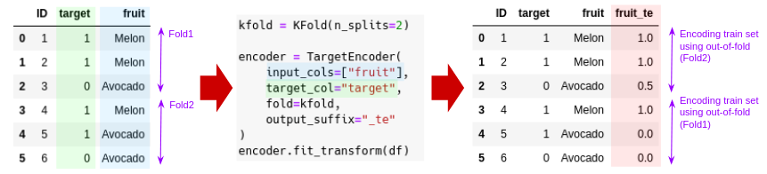
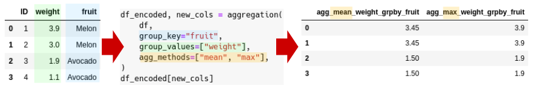

# xfeat

**[Slides](_docs/xfeat_slides.pdf)** | **[Tutorial](examples/xfeat_tutorial_notebook.ipynb)** | **[Document](#document)** | **[Installation](#installation)**

Flexible Feature Engineering & Exploration Library using GPUs and [Optuna](https://github.com/optuna/optuna).

xfeat provides sklearn-like transformation classes for feature engineering and exploration. Unlike sklearn API, xfeat provides a dataframe-in, dataframe-out interface. xfeat supports both [pandas](https://pandas.pydata.org/) and [cuDF](https://github.com/rapidsai/cudf) dataframes. By using cuDF and [CuPy](https://github.com/cupy/cupy), xfeat can generate features 10 ~ 30 times faster than a naive pandas operation.

|  |  |
|------------------------------------------------------------------|-------|
| Group-by aggregation benchmark ([result](./_docs/groupby_aggregation_benchmark.md)) | Target encoding benchmark ([result](./_docs/target_encoding_benchmark.md)) |

## Document

* [Slides](_docs/xfeat_slides.pdf)
* [Tutorial notebook](examples/xfeat_tutorial_notebook.ipynb)
* [Feature Encoding and Pipelining](./_docs/feature_encoding.md)
* [Target encoding and benchmark result](./_docs/target_encoding_benchmark.md)
* [Group-by aggregation and benchmark result](./_docs/groupby_aggregation_benchmark.md)
* Feature selection with Optuna

More examples are available in the [./examples](examples/) directory.

## Quick Start

xfeat provides a dataframe-in, dataframe-out interface:


### Feature Engineering

It is possible to sequentially concatenate encoder objects with `xfeat.Pipeline`. To avoid repeating the same feature extraction process, it is useful to output the results to the feather file format.

* More encoder classes available [here](./_docs/feature_encoding.md).

```python
import pandas as pd
from xfeat import Pipeline, SelectNumerical, ArithmeticCombinations

# 2-order Arithmetic combinations.
Pipeline(
    [
        SelectNumerical(),
        ArithmeticCombinations(
            exclude_cols=["target"], drop_origin=True, operator="+", r=2,
        ),
    ]
).fit_transform(pd.read_feather("train_test.ftr")).reset_index(
    drop=True
).to_feather(
    "feature_arithmetic_combi2.ftr"
)
```

### Target Encoding with cuDF/CuPy



Target encoding can be greatly accelerated with cuDF. Internally, aggregation is computed on the GPU using CuPy.

```python
from sklearn.model_selection import KFold
from xfeat import TargetEncoder

fold = KFold(n_splits=5, shuffle=False)
encoder = TargetEncoder(input_cols=cols, fold=fold)

df = cudf.from_pandas(df)  # if cuDF is available.
df_encoded = encoder.fit_transform(df)
```

### Groupby features with cuDF



Benchmark result: [Group-by aggregation and benchmark result](./_docs/groupby_aggregation_benchmark.md).

```python
from xfeat import aggregation

df = cudf.from_pandas(df)  # if cuDF is available.
df_agg = aggregation(df,
                     group_key="user_id",
                     group_values=["price", "purchased_amount"],
                     agg_methods=["sum", "min", "max"]
                     ).to_pandas()
```

### Feature Selection with GBDT feature importance

Example code: [examples/feature_selection_with_gbdt.py](examples/feature_selection_with_gbdt.py)

```python
from xfeat import GBDTFeatureSelector

params = {
    "objective": "regression",
    "seed": 111,
}
fit_kwargs = {
    "num_boost_round": 10,
}

selector = GBDTFeatureSelector(
    input_cols=cols,
    target_col="target",
    threshold=0.5,
    lgbm_params=params,
    lgbm_fit_kwargs=fit_kwargs,
)
df_selected = selector.fit_transform(df)
print("Selected columns:", selector._selected_cols)
```

### Feature Selection with Optuna

`GBDTFeatureSelector` uses a percentile hyperparameter to select features with the highest scores.
By using Optuna, we can search for the best value for this hyperparameter to maximize the objective.

Example code: [examples/feature_selection_with_gbdt_and_optuna.py](examples/feature_selection_with_gbdt_and_optuna.py)

```python
import optuna

def objective(df, selector, trial):
    selector.set_trial(trial)
    selector.fit(df)
    input_cols = selector.get_selected_cols()

    # Evaluate with selected columns
    train_set = lgb.Dataset(df[input_cols], label=df["target"])
    scores = lgb.cv(LGBM_PARAMS, train_set, num_boost_round=100, stratified=False, seed=1)
    rmsle_score = scores["rmse-mean"][-1]
    return rmsle_score


selector = GBDTFeatureExplorer(
    input_cols=input_cols,
    target_col="target",
    fit_once=True,
    threshold_range=(0.6, 1.0),
    lgbm_params=params,
    lgbm_fit_kwargs=fit_params,
)

study = optuna.create_study(direction="minimize")
study.optimize(partial(objective, df_train, selector), n_trials=20)

selector.from_trial(study.best_trial)
print("Selected columns:", selector.get_selected_cols())
```

## Installation

```
$ python setup.py install
```

If you want to use GPUs, cuDF and CuPy are required. See the [cuDF installation guide](https://github.com/rapidsai/cudf#installation).

### For Developers

```
$ python setup.py test
```
