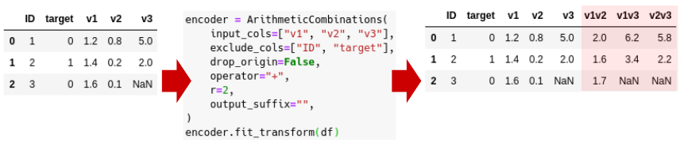

# Feature Encoding and Pipelining

xfeat provides dataframe-in, dataframe-out interface for dataset transformations.
Like [Dataset transformations in sklearn](https://scikit-learn.org/stable/data_transforms.html),
these are represented by classes with a `fit` method, which learns model parameters (e.g. mean and standard deviation for normalization) from a training set, and a `transform` method which applies this transformation model to unseen data. `fit_transform` may be more convenient and efficient for modelling and transforming the training data simultaneously.



The following encoders are provided:

* Categorical encoder:
    * `xfeat.SelectCategorical`
    * `xfeat.LabelEncoder`
    * `xfeat.ConcatCombination`
    * `xfeat.TargetEncoder`
    * `xfeat.CountEncoder`
    * `xfeat.UserDefinedLabelEncoder`.
* Numerical encoder:
    * `xfeat.SelectNumerical`, `xfeat.ArithmeticCombination`.
* User-defined encoder:
    * `xfeat.LambdaEncoder`.

The usage is described in the docstrings. Details available with the `pydoc` command:

```bash
$ pydoc xfeat.TargetEncoder
```

## Pipelining

`xfeat.Pipeline` sequentially concatenate encoder objects.

```python
from xfeat import Pipeline, SelectCategorical, ConcatCombination, TargetEncoder

encoder = Pipeline(
    [
        SelectCategorical(),
        ConcatCombination(),
        TargetEncoder(),
    ]
)
df_encoded = encoder.fit_transform(df)
```

## Helper function

### Group-by aggregation

`xfeat.aggregation` is a helper function to generate group-by aggregation features.
It generates a group from the `group_key` column and aggregates the numerical values in the `group_values` columns.

### Data Compaction

`compress_df` reduces a DataFrame's memory footprint by converting the data types. Since Feather File Format does not support `float8`, float values will be converted to `float16` at a minimum.

```python
from xfeat.utils import compress_df

df = pd.read_feather("train_test.ftr")
compress_df(df, verbose=True)
```
