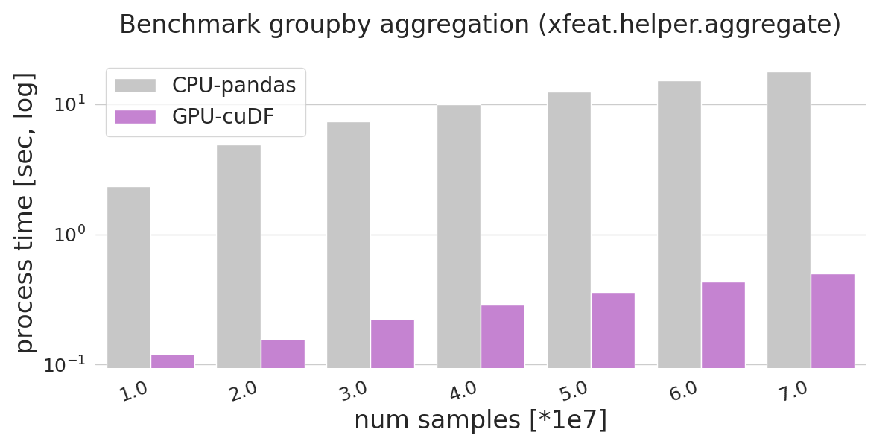

# Group-by aggregation with xfeat


`xfeat.aggregation` is a helper function to aggregate values after grouping table rows by a given key.

## Benchmark

For the detailed experiment scripts and output logs, please refer to [/examples/benchmark](#).

## Data

* record size: 1M ~ 10M records.
* groupby-key size: 100

## Environment

All experiments run on a single Linux server (AWS p3.2xlarge) with the following specifications:

* p3.2xlarge on AWS EC2.
* OS: Ubuntu 18.04
* Intel(R) Xeon(R) CPU E5-2686 v4 @ 2.30GHz
* GPU: NVIDIA Tesla V100 x1
* Docker image: `smly/xfeat-cudf` ([Dockerfile](../examples/benchmark/docker/Dockerfile))

## Results



## Usage of benchmark script

```bash
$ docker run -it --rm \
    -v /etc/group:/etc/group:ro \
    -v /etc/passwd:/etc/passwd:ro \
    -u $(id -u $USER):$(id -g $USER) \
    -v /home/ubuntu/xfeat:/root \
    smly/xfeat-cudf bash

ubuntu@:/root$ CUPY_CACHE_DIR=/root PYTHONPATH=. python examples/benchmark/feature_aggregation.py
```
